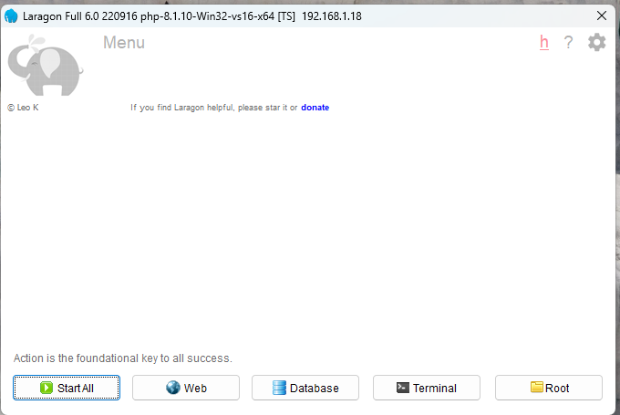
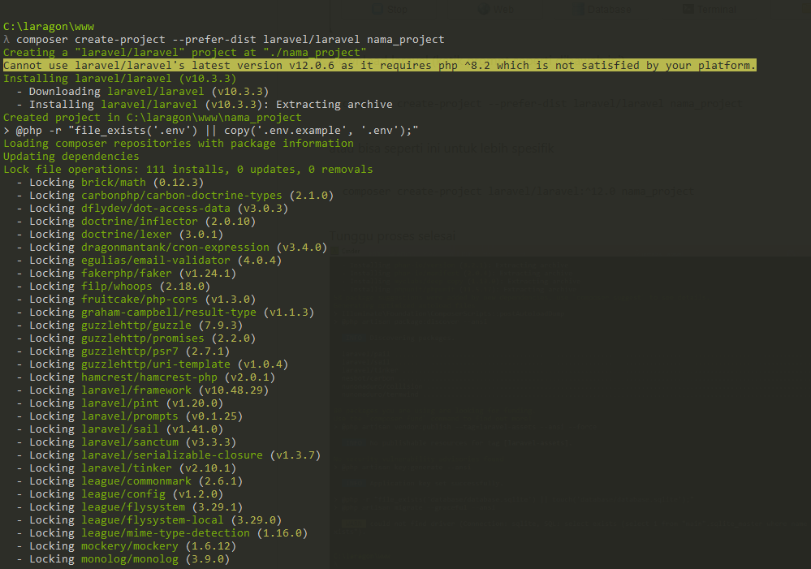
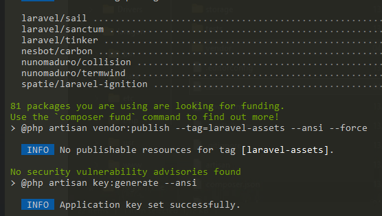
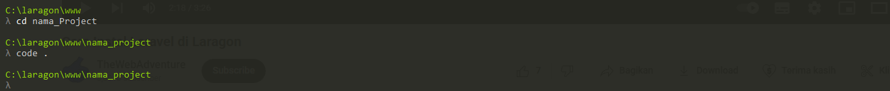
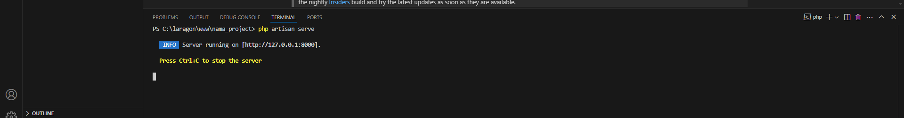
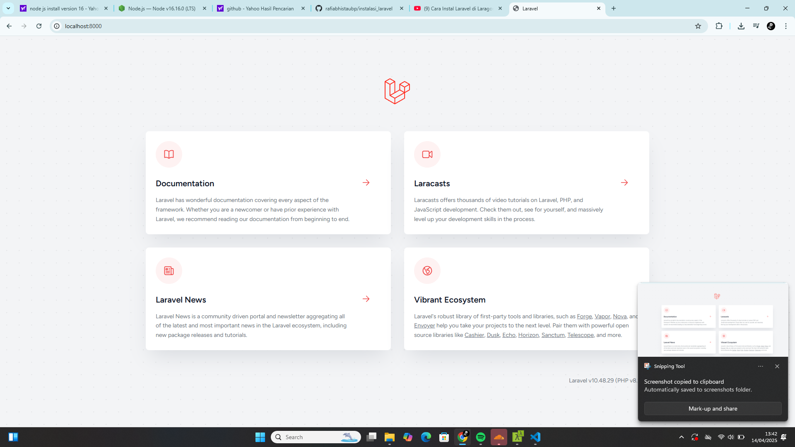

# project-laravel 
pastikan sudah menginstall laragon dan composer
1. jalankan laragon, lalu klik/buka terminal

2. Download laravel seperti dibawah ini
ketik prompt 
composer create-project --prefer-dist laravel/laravel nama_project
tunggu sampai proses selesai

dan apabila success

3. buka laravel dan ketik (cd nama_Project)
buka text editor dan ketik (cd .)

4. untuk menjalankan project ketik prompt (php artisan serve)

5. dan cek. laravel sudah berjalan.

